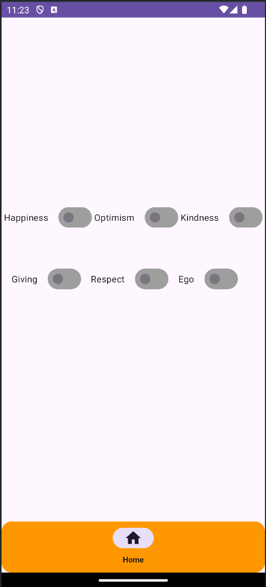
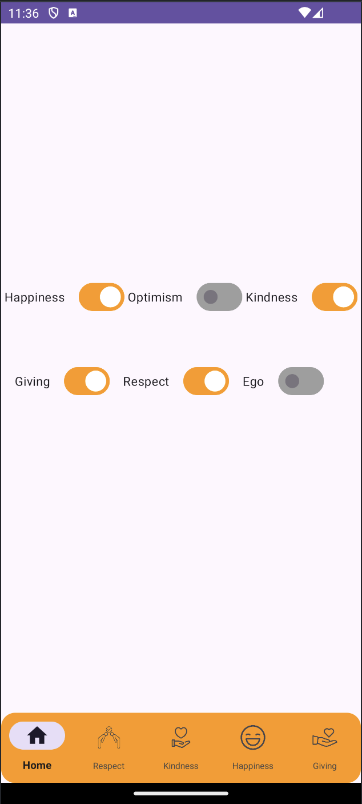
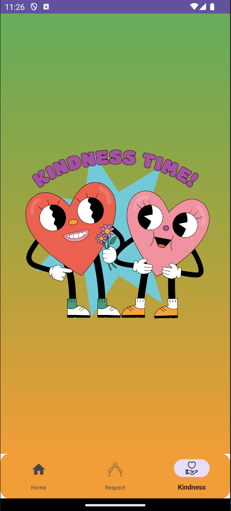
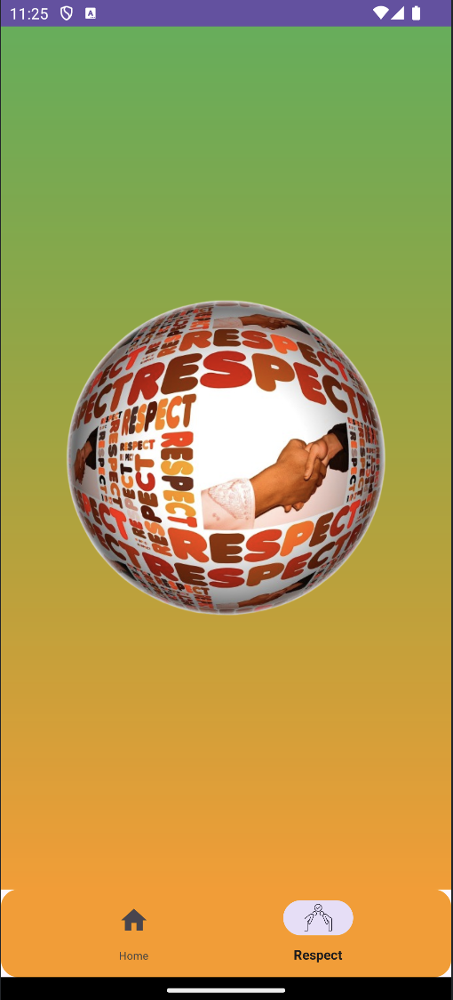

# Kekod Challenge One

This repository contains the project for the Kekod Challenge One. The project is developed in Kotlin and structured to demonstrate core Android development principles, including View Binding, and efficient navigation using the Navigation Component and BottomNavigationView.

## Features
- **View Binding**: Simplifies view interactions and reduces boilerplate code.
- **Navigation Component**: Handles in-app navigation with ease.
- **BottomNavigationView**: Implemented for smooth and intuitive bottom navigation.

<h2 align="center">
Screenshots</h2>

