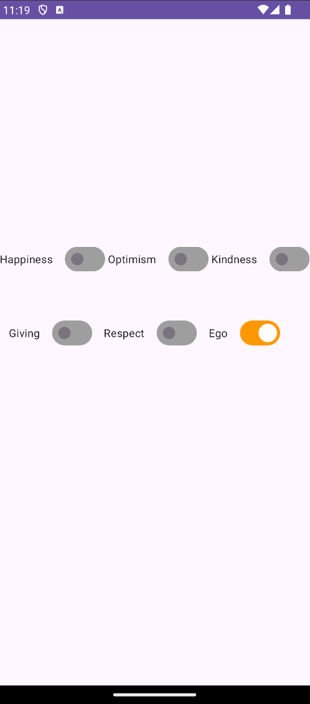

<h1 align= center>
  Switch Board
</h1>

This repository contains the project for the Switch Board. The project is developed in Kotlin and structured to demonstrate core Android development principles, including View Binding, and efficient navigation using the Navigation Component and BottomNavigationView.

## :point_down: Features
- **MVVM Architecture**: Ensures a clean separation of concerns and easier maintainability by following the Model-View-ViewModel architecture.
- **View Binding**: Simplifies view interactions and reduces boilerplate code.
- **Navigation Component**: Handles in-app navigation with ease.
- **BottomNavigationView**: Implemented for smooth and intuitive bottom navigation.
- **Lottie Animations**: Adds smooth and visually appealing animations to enhance user experience.

## Video
https://github.com/user-attachments/assets/9ee563c4-5a93-435c-bc0e-27984f19f8c4

<h2>
Screenshots
</h2>

